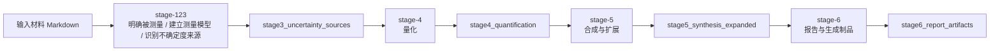

# uncertainty-agent

基于 [pi-mono](https://github.com/badlogic/pi-mono) agent-core 的多 SubAgent pipeline，用于化学测量不确定度评定。

## 架构

工作流由 4 个 SubAgent 串联组成，前序产物写入 `context.json`，后续 SubAgent 只接收自己需要的前一产物。



`stage-123` 是同一个 Agent 内的渐进式 checkpoint：

1. 明确被测量 → `stage1_measurand`
2. 建立测量模型 → `stage2_measurement_model`
3. 识别不确定度来源 → `stage3_uncertainty_sources`

每个 checkpoint 或 stage 完成时调用 `finishWork` 提交 JSON。`finishWork` 根据 `config/schemas/*.schema.json` 校验，通过后写入对应 context 字段，并返回下一个 checkpoint 要求或结束当前 SubAgent。

## 工具面

运行 SubAgent 始终获得：

- `finishWork`：提交当前 checkpoint/stage JSON，完成 schema 校验并推进工作流。
- `search_reference`：调用 StandardRAG `/query-tree` 检索标准、规范和参考依据。
- `calculate`：执行结构化数值计算。

输入材料 Markdown 只注入 `stage-123` 的首个 user prompt。`stage-4`、`stage-5`、`stage-6` 分别只接收前一个阶段的产物。

## 运行

```bash
bun install
bun run build
```

单个 Markdown 输入：

```bash
bun run start -- --input=input/atomic-steps-testset-input/UA-001-balance-tare/procedure.md
```

指定输出目录继续/重跑（`--startFrom=4` 会定位到 `stage-4`）：

```bash
bun run start -- --input=input/atomic-steps-testset-input/UA-001-balance-tare/procedure.md --run-dir=output/example-run --resume
bun run start -- --input=input/atomic-steps-testset-input/UA-001-balance-tare/procedure.md --run-dir=output/example-run --startFrom=4
```

只创建 fork、不启动 pipeline：

```bash
bun run start -- --input=input/atomic-steps-testset-input/UA-001-balance-tare/procedure.md --run-dir=output/example-run --fork-only --startFrom=5
```

`search_reference` 默认连接 `http://127.0.0.1:8000/query-tree`。可用 `--reference-url=` 或环境变量 `REFERENCE_QUERY_URL` / `STANDARDRAG_QUERY_TREE_URL` 覆盖。工具只发送 `question` 和 `top_k`。

## Atomic steps 测试集管线

跑完整测试集：

```bash
bun run testset -- --model=provider/model
```

只跑单题验证流程：

```bash
bun run testset -- --case=UA-001-balance-tare --model=provider/model
```

默认 4 worker 并发执行；可用 `--workers=N`（或 `--concurrency=N`）调整。

每题会先跑完整不确定度评定 pipeline，再用同一个模型启动独立 requirements evaluation agent；结果写到 `output/testset/<case>_<time>/requirements_evaluation.md`，总表写到 `output/testset/summary.md`。

## License

MIT
