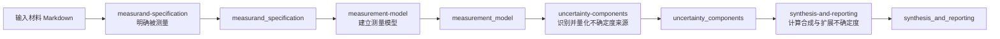

# uncertainty-agent

基于 [pi-mono](https://github.com/badlogic/pi-mono) agent-core 的多 SubAgent pipeline，用于化学测量不确定度评定。

## 架构

工作流只保留 4 个 SubAgent，前序产物写入 `context.json`，后续 SubAgent 只接收自己需要的前一产物。



每个 stage 完成时调用 `finishWork` 提交 JSON。`finishWork` 根据 `config/schemas/four-phase/*.schema.json` 校验，通过后写入对应 context 字段并结束当前 SubAgent。

## 工具面

运行 SubAgent 始终获得：

- `finishWork`：提交当前 stage JSON，完成 schema 校验并推进工作流。
- `search_reference`：调用 StandardRAG `/query-tree` 检索标准、规范和参考依据。
- `calculate`：执行结构化数值计算。

输入材料 Markdown 注入需要原始材料的 stage；后续 stage 通过 `inputContextField` 接收上一阶段产物。

## 运行

```bash
bun install
python3 -m pip install -r requirements.txt
bun run build
```

单个 Markdown 输入：

```bash
bun run start -- --input=input/atomic-steps-testset-input/UA-001-balance-tare/procedure.md
```

指定输出目录继续/重跑（`--startFrom=4` 会定位到第 4 个 stage，即 `synthesis-and-reporting`）：

```bash
bun run start -- --input=input/atomic-steps-testset-input/UA-001-balance-tare/procedure.md --run-dir=output/example-run --resume
bun run start -- --input=input/atomic-steps-testset-input/UA-001-balance-tare/procedure.md --run-dir=output/example-run --startFrom=4
```

只创建 fork、不启动 pipeline：

```bash
bun run start -- --input=input/atomic-steps-testset-input/UA-001-balance-tare/procedure.md --run-dir=output/example-run --fork-only --startFrom=4
```

`search_reference` 默认连接 `http://127.0.0.1:8000/query-tree`。可用 `--reference-url=` 或环境变量 `REFERENCE_QUERY_URL` / `STANDARDRAG_QUERY_TREE_URL` 覆盖。工具只发送 `question` 和 `top_k`。

模型配置读取 `~/.pi/agent/models.json`；API key 可以写环境变量名，也可以写 literal key。归档提交时不要提交真实 API key 或 `.env` 文件。

## Atomic steps 测试集管线

跑完整测试集：

```bash
bun run testset -- --model=provider/model
```

只跑单题验证流程：

```bash
bun run testset -- --case=UA-001-balance-tare --model=provider/model
```

默认 4 worker 并发执行；可用 `--workers=N`（或 `--concurrency=N`）调整。

每题会先跑完整不确定度评定 pipeline，再用同一个模型启动独立 requirements evaluation agent；结果写到 `output/testset/<case>_<time>/requirements_evaluation.md`，总表写到 `output/testset/summary.md`。

## 归档建议

交付归档时建议打包源码目录，但不要包含以下本地生成目录：

- `node_modules/`
- `dist/`
- `output/`
- `output-archive/`
- `.git/`
- `.yachiyo/`

这些目录已在 `.gitignore` 中排除。重新复现时按上面的安装命令执行即可。

## License

MIT
